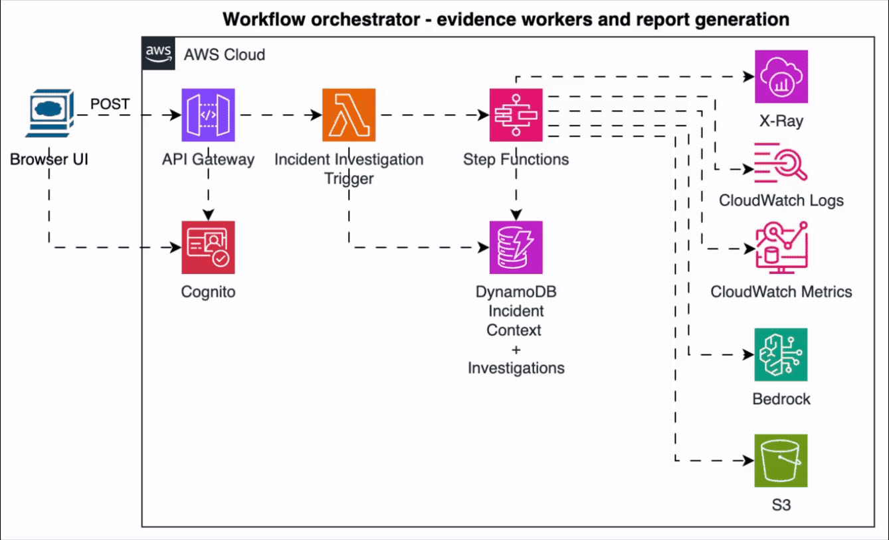
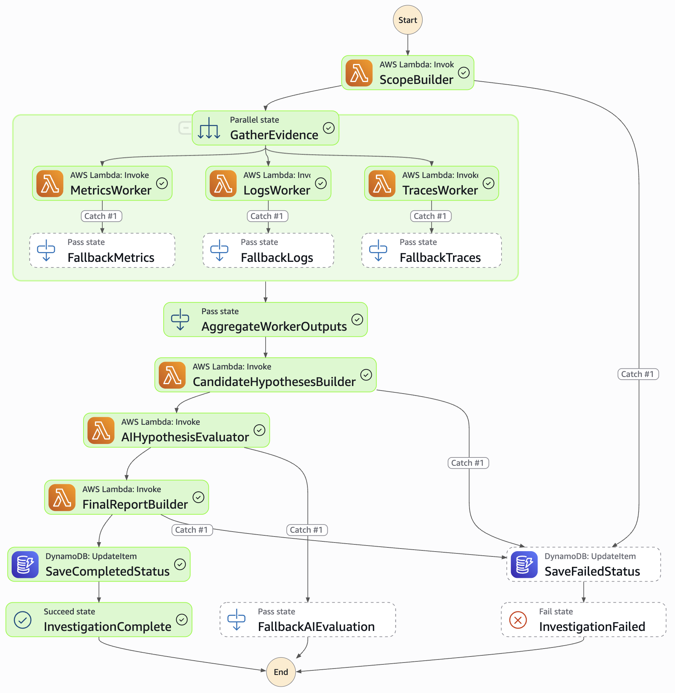
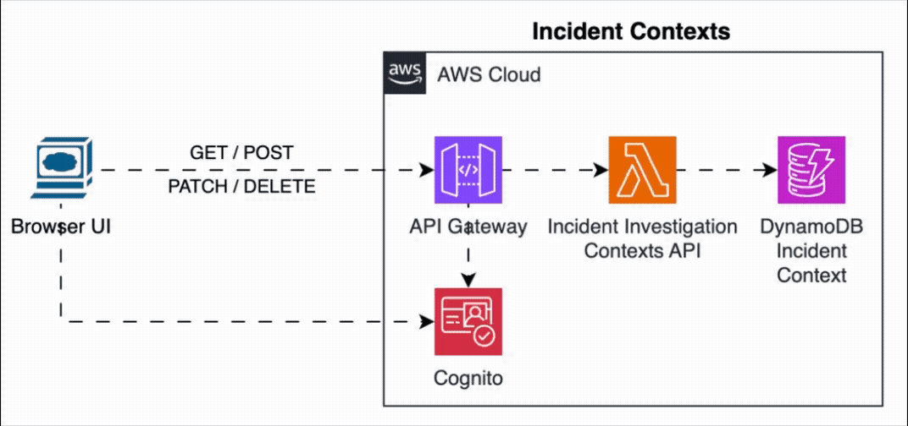
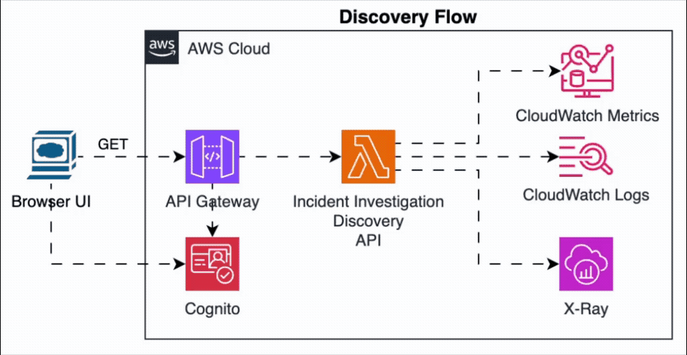
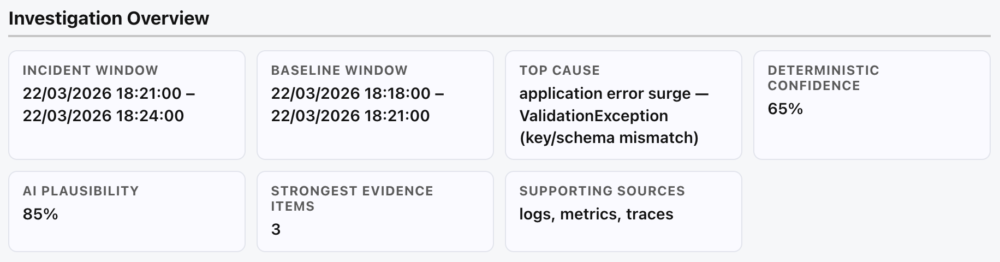
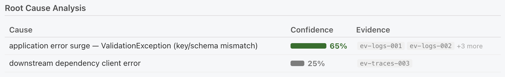
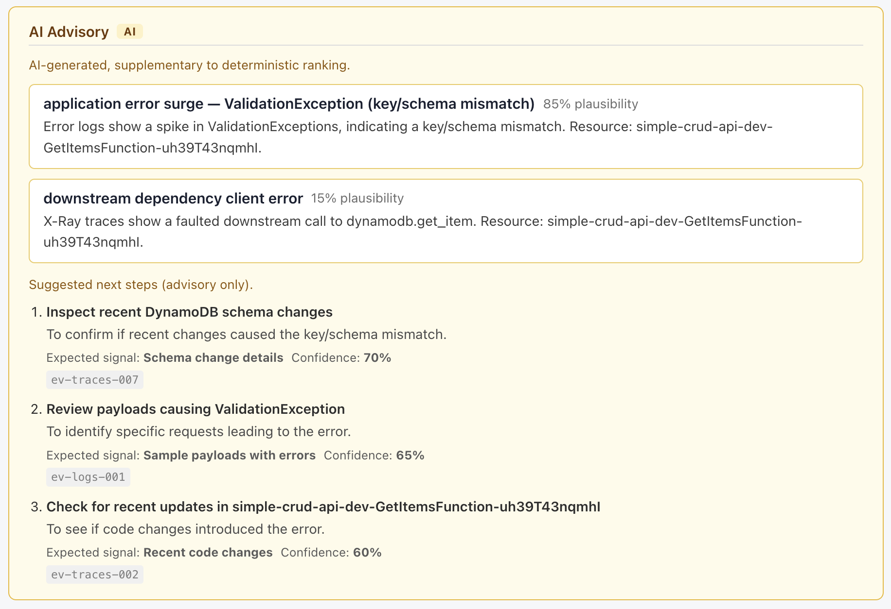
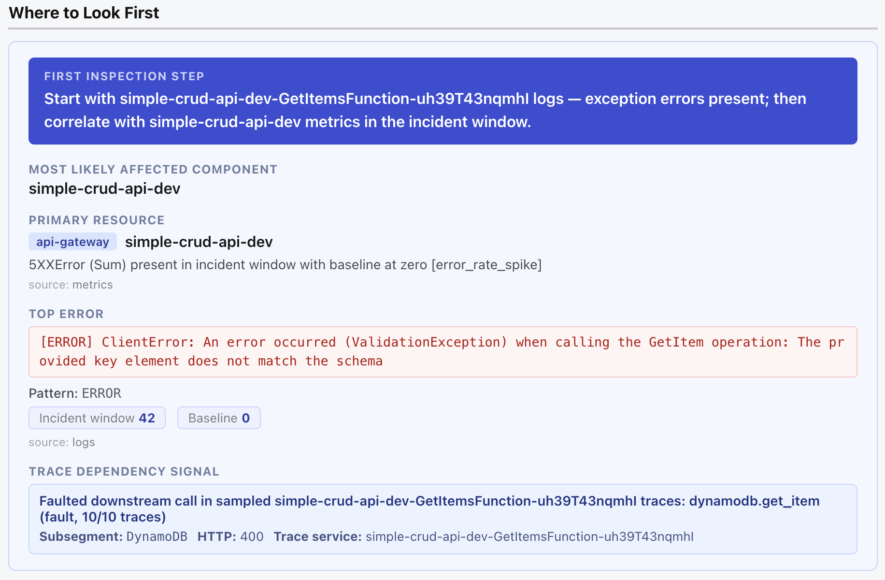

# Incident Investigator

AWS-native incident investigation workflow — a PoC demonstrating how to build a credible, cost-aware, deterministic-first approach to AI-assisted root-cause analysis.

When an incident is triggered, the system scopes the investigation from a saved incident context, collects targeted observability evidence (metrics, logs, traces), builds candidate root-cause hypotheses deterministically, uses bounded GenAI to evaluate competing hypotheses and identify missing evidence, and presents the result in an operator-focused incident report UI.

**Why deterministic-first?** Using AI for everything is expensive, slow to explain, and hard to audit. This project keeps evidence collection and hypothesis ranking fully deterministic — AI is introduced only at the evaluation layer, where it adds genuine value: comparing competing causes, explaining ambiguity, and surfacing missing evidence. The result is a system that is explainable, cost-efficient, and reliable even when AI is unavailable.

> This is a **PoC** — intentionally bounded in scope, not production-hardened. The goal is a clean, credible demonstration of architecture judgment, not a shipping product.

## Architecture Overview

<p align="center">
  
</p>

**How it works:**
1. An operator triggers an investigation with a saved incident context and time window.
2. Step Functions orchestrates scoped evidence collection (metrics, logs, traces) in parallel.
3. A deterministic hypothesis builder ranks candidate root causes from the combined evidence.
4. Amazon Bedrock evaluates the shortlisted hypotheses as a bounded AI advisory layer.
5. A final report is assembled and rendered in the UI.

Incident contexts are runtime-managed via API/UI and supplied to investigations via `contextId`.

### Step Functions Workflow

<p align="center">
  
</p>

### Operational Flows

<table>
  <tr>
    <td align="center" width="50%">
      <strong>Incident Contexts (CRUD)</strong><br/>
      
    </td>
    <td align="center" width="50%">
      <strong>Resource Discovery</strong><br/>
      
    </td>
  </tr>
  <tr>
    <td align="center" colspan="2">
      <strong>Investigation Status / Report API</strong><br/>
      
    </td>
  </tr>
</table>

## See It In Action

### Managing Incident Contexts

<p align="center">
  
</p>

### Triggering an Investigation & Viewing the Report

<p align="center">
  
</p>

### What a Report Looks Like

<table>
  <tr>
    <td align="center" width="50%">
      <strong>Investigation Overview</strong><br/>
      
    </td>
    <td align="center" width="50%">
      <strong>Root Cause Analysis</strong><br/>
      
    </td>
  </tr>
  <tr>
    <td align="center" width="50%">
      <strong>AI Advisory</strong><br/>
      
    </td>
    <td align="center" width="50%">
      <strong>Where to Look First</strong><br/>
      
    </td>
  </tr>
</table>

[See full investigation examples →](docs/INVESTIGATIONS.md)

## What this is NOT

- Not autonomous remediation or automated rollback
- Not a general-purpose AIOps platform
- Not cross-account or multi-region
- Not production-hardened or multi-tenant
- Not a RAG platform over runbooks or incident history
- Not a full observability product (no dashboards, alerting, or on-call paging)
- Not a free-form autonomous agent loop

## Technology Stack

| Layer | Technology |
|---|---|
| **Backend** | Python 3.12 (all Lambda functions) |
| **Infrastructure** | AWS CDK (Python) |
| **Frontend** | React + Vite |
| **AI** | Amazon Bedrock |
| **Storage** | DynamoDB + S3 |
| **Orchestration** | AWS Step Functions |

## 90-Second Demo Story

1. **Problem framing**: an operator triggers an investigation (e.g. latency spike or error spike) with a saved incident context.
2. **Deterministic investigation**: workers collect scoped evidence (metrics/logs/traces), and hypotheses are ranked with deterministic confidence.
3. **Bounded AI advisory**: AI compares top hypotheses, adds plausibility/explanation, and suggests next investigative actions.
4. **Operator output**: UI presents a concise report with:
   - top deterministic hypothesis and confidence breakdown,
   - strongest evidence and where-to-look-first guidance,
   - optional AI advisory (`aiAssessments`, `aiNextBestActions`).

This project demonstrates balancing deterministic reliability with practical AI assistance.

## How AI is used in this project

AI is used in a **bounded, advisory** role — not as an autonomous operator.

- Workers collect evidence deterministically (metrics, logs, traces)
- Candidate hypotheses are built with deterministic rules and named confidence constants
- AI (Amazon Bedrock) reviews the shortlisted hypotheses and structured evidence
- AI assigns comparative plausibility and explains why one hypothesis looks stronger or weaker
- AI highlights missing evidence that would improve confidence
- AI does not discover resources, replace evidence collection, or execute actions
- AI does not override the deterministic pipeline
- The split keeps the system explainable, cost-aware, and auditable

See [AI Design](docs/AI_DESIGN.md) for full design details.

### Why AI is advisory, not authoritative

This system intentionally treats AI as an **advisory layer** on top of deterministic investigation logic.

- Deterministic workers and hypothesis scoring remain the primary decision path.
- AI adds comparative plausibility, explanatory context, and suggested next investigative actions.
- AI output is bounded, schema-validated, and optional; failures degrade gracefully.
- AI does **not** execute actions, mutate infrastructure, or override deterministic ranking.

This design keeps incident analysis explainable and auditable while still benefiting from AI-assisted synthesis.

## Project Docs

- [Example Investigations](docs/INVESTIGATIONS.md)
- [Architecture](docs/ARCHITECTURE.md)
- [Execution Flow](docs/EXECUTION_FLOW.md)
- [API Contract](docs/API_CONTRACT.md)
- [AI Design](docs/AI_DESIGN.md)
- [Security](docs/SECURITY.md)
- [Architecture Decisions](docs/DECISIONS.md)

### Core Schemas
- [Incident Context](schemas/incident-context.schema.json)
- [Incident Trigger](schemas/incident.schema.json)
- [Context Snapshot](schemas/context-snapshot.schema.json)
- [Investigation Scope](schemas/scope.schema.json)
- [Evidence](schemas/evidence.schema.json)
- [Hypothesis](schemas/hypothesis.schema.json)
- [Worker Output](schemas/worker-output.schema.json)
- [Final Report](schemas/final-report.schema.json)

---

## Getting Started

### Prerequisites

- Python 3.12
- Node.js 18+
- AWS CLI ([install guide](https://docs.aws.amazon.com/cli/latest/userguide/getting-started-install.html))
- AWS CDK CLI: `npm install -g aws-cdk`
- AWS account with credentials configured (`aws configure` or `AWS_PROFILE`)

### Local Setup

```bash
# Clone the repo
git clone https://github.com/kerenoded/aws-incident-investigator.git
cd aws-incident-investigator

# Python virtual environment (CDK and infra tooling)
python3 -m venv .venv
source .venv/bin/activate

# CDK / infra dependencies
pip install -r requirements.txt

# Test / dev dependencies (pytest, jsonschema, boto3, etc.)
pip install -r requirements-dev.txt

# Frontend dependencies
cd frontend && npm install && cd ..
```

### Running Tests

All backend tests mock AWS — no live credentials or deployed stack needed.

```bash
# Run all backend tests from repo root
pytest

# Or explicitly
pytest backend/ -v

# A single component
pytest backend/workers/metrics/tests/ -v
```

Frontend smoke tests use Vitest:

```bash
cd frontend && npm test
```

### CI Checks

GitHub Actions CI runs on push and pull requests:
- backend lint (`ruff check backend infra app.py`)
- backend tests (`pytest backend/`)
- frontend typecheck (`npm --prefix frontend run typecheck`)
- frontend production build (`npm --prefix frontend run build`)
- infrastructure synthesis (`cdk synth`)

### Fast local quality commands

For consistent local developer UX, this repo includes a `Makefile`:

```bash
make lint              # backend ruff lint
make test-backend      # backend pytest suite
make test-frontend     # frontend vitest suite
make test-target       # focused evaluator/report tests
make typecheck-frontend
make build-frontend
make synth
```

These mirror the CI quality gates and provide a consistent local workflow.

### Design trade-offs (intentional)

- **Deterministic-first ranking**: Top hypotheses are always deterministic for consistency and auditability.
- **AI as additive advisory**: AI can explain/rank plausibility and suggest next actions, but does not override deterministic ranking.
- **Cost-aware by design**: Bedrock is invoked twice per investigation, on a shortlisted hypothesis set only — not on raw telemetry. Evidence collection is deterministic and scoped, keeping CloudWatch Logs Insights costs proportional to the incident window.
- **Bounded contracts over free-form output**: strict schemas and validation improve resilience and reduce operational risk.
- **Graceful degradation**: if AI is unavailable or returns invalid output, investigation still completes with deterministic report quality.

### Infra Validation (synth only)

```bash
export CDK_DEFAULT_ACCOUNT=<your-aws-account-id>
export CDK_DEFAULT_REGION=<your-region>   # e.g. eu-west-1

cdk synth
```

### Deploy Prerequisites

1. AWS credentials configured and `CDK_DEFAULT_ACCOUNT` / `CDK_DEFAULT_REGION` exported.
2. **Enable Bedrock model access manually** in the AWS console (navigate to Amazon Bedrock → Model access → enable the model you intend to use; default is Amazon Nova Micro). This is a one-time manual step; CDK cannot do it automatically.
3. Bootstrap CDK (one-time per account/region):
   ```bash
   cdk bootstrap aws://<account-id>/<region>
   ```
4. Deploy:
   ```bash
   cdk deploy
   ```
   The stack outputs include API + Cognito values needed by the frontend. Copy them into `frontend/.env`, you can use:
   ```bash
   cp frontend/.env.example frontend/.env
   ```
   - `ApiApiEndpoint` → `VITE_API_URL`
   - `ApiCognitoRegion` → `VITE_COGNITO_REGION`
   - `ApiCognitoUserPoolClientId` → `VITE_COGNITO_CLIENT_ID`
   - `ApiCognitoHostedUiDomain` is a prefix; set `VITE_COGNITO_DOMAIN` to `<prefix>.auth.<region>.amazoncognito.com`

   If you are running locally you can add:
   - `VITE_COGNITO_REDIRECT_URI=http://localhost:5173`
   - `VITE_COGNITO_LOGOUT_URI=http://localhost:5173`
   And in order to run: 
   ```bash
   npm --prefix frontend run dev
   ```

### Cognito callback/logout URL context

By default, the stack uses `allowed_cors_origin` as the Cognito callback/logout URL.
For local dev and a deployed frontend, pass both explicitly via CDK context:

```bash
cdk deploy \
  -c allowed_cors_origin=https://<your-frontend-domain> \
  -c cognito_callback_urls=http://localhost:5173,https://<your-frontend-domain> \
  -c cognito_logout_urls=http://localhost:5173,https://<your-frontend-domain>

# or locally only:
cdk deploy \
  -c allowed_cors_origin=http://localhost:5173 \
  -c cognito_callback_urls=http://localhost:5173 \
  -c cognito_logout_urls=http://localhost:5173
```

### Frontend Dev Server

```bash
# Copy the env template and set API/auth values for your environment
cp frontend/.env.example frontend/.env
# Edit frontend/.env and set:
# - VITE_API_URL=<your-api-gateway-url>
# - VITE_COGNITO_REGION=<stack-output-CognitoRegion>
# - VITE_COGNITO_CLIENT_ID=<stack-output-CognitoUserPoolClientId>
# - VITE_COGNITO_DOMAIN=<stack-output-CognitoHostedUiDomain>

npm --prefix frontend run dev      # starts Vite dev server at http://localhost:5173
npm --prefix frontend run build    # produces frontend/dist/
```

### Basic Usage Flow

```bash
# 1. Trigger an investigation
curl -X POST https://<api-url>/investigations \
  -H "Content-Type: application/json" \
  -H "Authorization: Bearer <access_token>" \
  -d '{"contextId": "ctx-123", "signalType": "latency_spike", "windowStart": "2026-03-19T12:00:00Z", "windowEnd": "2026-03-19T12:15:00Z"}'

# 2. Poll for status
curl -H "Authorization: Bearer <access_token>" https://<api-url>/investigations/<incidentId>

# 3. Fetch the report when status is COMPLETED
curl -H "Authorization: Bearer <access_token>" https://<api-url>/investigations/<incidentId>/report
```

Open the frontend URL (from CDK outputs) to view the rendered report in the UI. See [API Contract](docs/API_CONTRACT.md) for full request/response shapes.

---

## AWS Services Used

### Currently used

| Service | Role |
|---|---|
| API Gateway | HTTP API entry point for triggering and querying investigations |
| Cognito User Pool | Browser user authentication via Hosted UI + OAuth2 PKCE |
| Step Functions | Orchestrates the full investigation workflow |
| Lambda | All compute: scope builder, workers, AI steps, report builder |
| Bedrock (Nova Micro) | AI hypothesis evaluation |
| DynamoDB | Investigation metadata and status (on-demand billing) |
| S3 | Evidence payloads and worker outputs |
| CloudWatch Logs | Lambda log destination and evidence source (Logs Insights queries) |
| CloudWatch Metrics | Evidence source (metrics worker queries CloudWatch Metrics API) |
| X-Ray | Evidence source (trace worker queries scoped traces) |

### Extension points (deliberately out of scope)

The architecture is designed to be extended without structural changes. Each item below is a natural next layer — not a workaround, but a clean addition to the existing worker/trigger pattern.

| Extension | Value | What it would take |
|---|---|---|
| **CloudTrail worker** | Surface recent deployments, config changes, and IAM activity within the incident window — often the missing link in root-cause analysis | Add a `CloudTrailWorker` following the existing worker envelope contract; query `LookupEvents` scoped to the incident window; emit findings like `recent_deployment` and `iam_policy_change` |
| **EventBridge alarm trigger** | Let CloudWatch Alarms auto-trigger investigations without operator action | Add an `aws.cloudwatch` event handler branch in the trigger Lambda's `lambda_handler` router; normalize the alarm payload into the existing incident schema |
| **CloudWatch Alarms as evidence** | Include active alarm state as a corroborating evidence source in hypotheses | Add an `AlarmsWorker` that queries the Alarms API for the incident window; emit findings of type `alarm_breach` |
| **Cross-account support** | Investigate services across AWS account boundaries | Pass an assumable role ARN in the incident context; have each worker assume the role before making API calls |

---

## Cost Behavior

- **Zero cost when not deployed** — nothing runs, nothing charges.
- **Near-zero idle cost when deployed but not used** — DynamoDB on-demand (no reads/writes = no charge), Lambda and Step Functions bill only on invocation, S3 and CloudWatch log storage are negligible at dev scale.
- **Main variable cost drivers per investigation:**
  - **Bedrock** — two API calls per investigation; cost depends on token usage and model selected (default: Amazon Nova Micro). This is the primary variable cost.
  - **CloudWatch Logs Insights** — queries are scoped to specific log groups and the incident window; cost is per GB scanned.
  - **Step Functions** — billed per state transition; small fixed cost per investigation.
  - **Lambda** — billed per invocation and duration; negligible at dev scale.

> The Bedrock model and token usage are the main cost levers. Everything else is effectively free at dev/low-traffic scale.

---

## Known Limitations

This project is **not production-ready**.

| Limitation | Detail |
|---|---|
| **Authorization remains intentionally simple** | API authentication is enforced with Cognito. Incident contexts are owner-managed, and investigation runtime authorization still uses Cognito service groups derived from the selected context. Group provisioning/membership is manual, and broader RBAC remains deferred. See [docs/SECURITY.md](docs/SECURITY.md). |
| **Single account, single region** | No cross-account or multi-region support. |
| **Two signal types only** | Supports `latency_spike` and `error_spike`. Other incident types (availability, saturation) are not implemented. |
| **Dev-grade infrastructure** | DynamoDB on-demand, no reserved Lambda concurrency, no WAF, no VPC, and no strict retention enforcement guarantees (TTL is populated on metadata items, but DynamoDB TTL deletion is asynchronous/best-effort). |
| **Cognito self-sign-up is open** | The Cognito User Pool allows self-registration by default. For a restricted environment, set `self_sign_up_enabled=False` in `infra/api/api_constructs.py` and provision users manually or via IdP federation. |
| **Bedrock access not automatic** | Model access must be enabled manually in the AWS console before first deploy. |
| **Alarm trigger not implemented** | EventBridge-based alarm trigger is deferred; only API-driven trigger exists. |
| **CI is minimal** | CI currently validates backend tests, frontend build, and CDK synth only (no deploy pipeline in this repository). |
| **Frontend API URL is manual** | After `cdk deploy`, copy the API Gateway URL into `frontend/.env` manually. |
