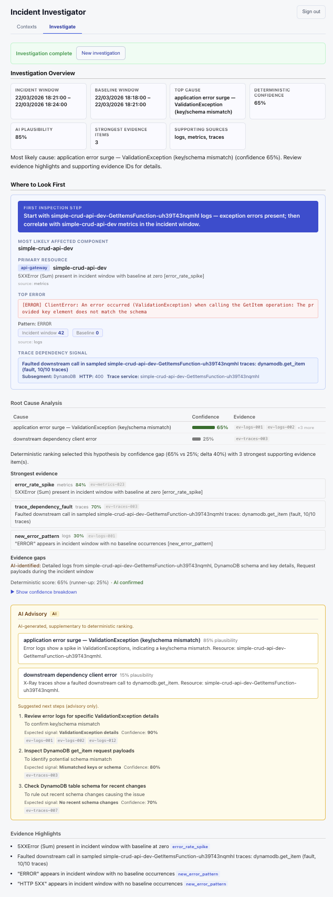
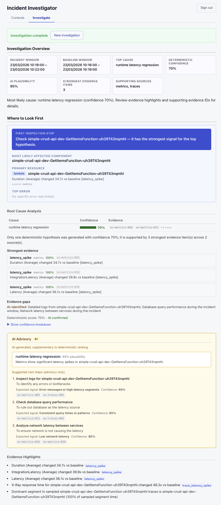
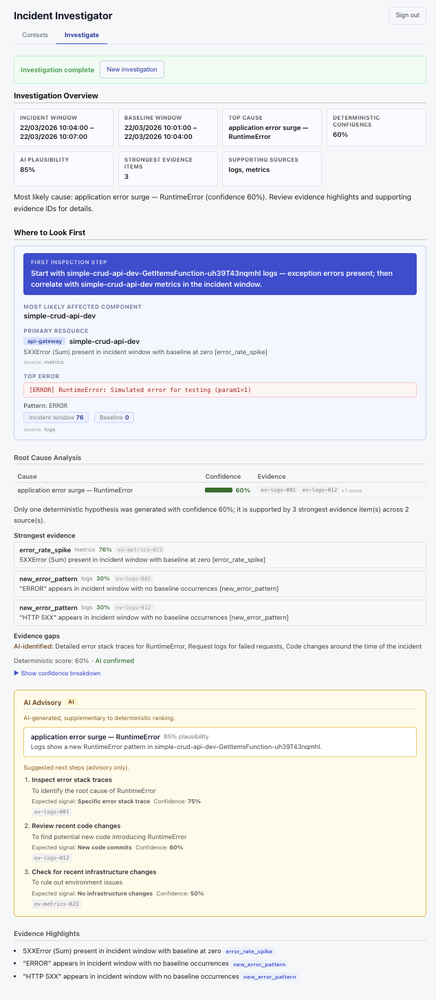
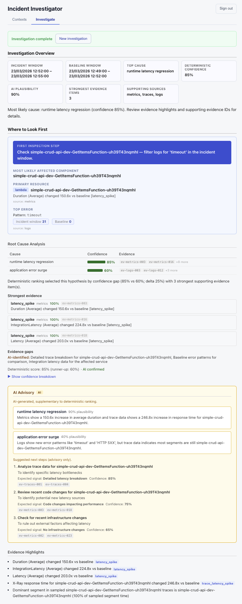

# Example Investigations

Four real investigations run with this system, demonstrating report output across different incident types.

---

## DynamoDB Key Mismatch

  

---

## Latency Regression

  

---

## Lambda RuntimeError

  

---

## Lambda Timeout

  

